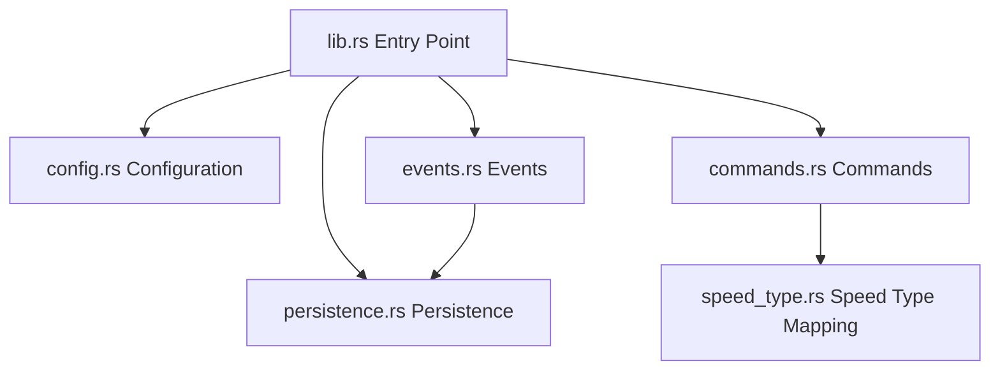

# SpeedControl Plugin Architecture & Design Guide

This document describes the architectural layout, modules, and implementation details of the `SpeedControl` WebAssembly Minecraft plugin, focusing on the application of **SOLID** clean design principles.

---

## 1. Architectural Overview

The plugin is structured as a collection of decoupled, highly focused modules under `src/`. Instead of a monolithic `lib.rs`, tasks like configuration handling, persistence, command parsing, and event handling are separated.



---

## 2. Component Directory

| Module | Responsibility |
| :--- | :--- |
| [lib.rs](file:///c:/VSCodeProjects/PumpkinPlugins/SpeedControl/src/lib.rs) | Plugin lifecycle coordinator. Registers commands, events, and permissions with the Pumpkin host context. |
| [config.rs](file:///c:/VSCodeProjects/PumpkinPlugins/SpeedControl/src/config.rs) | Handles data-structures, default values, serialization/deserialization, and format migration for the configuration file `config.json`. |
| [persistence.rs](file:///c:/VSCodeProjects/PumpkinPlugins/SpeedControl/src/persistence.rs) | Manages player speed persistence. Defines abstract storage contracts (`SpeedStore`) and concrete implementations (`JsonPlayerSpeedStore`). |
| [speed_type.rs](file:///c:/VSCodeProjects/PumpkinPlugins/SpeedControl/src/speed_type.rs) | Domain logic enumerating speed modifications (Fly, Walk, etc.) and details their mappings (scale, name, nodes). |
| [commands.rs](file:///c:/VSCodeProjects/PumpkinPlugins/SpeedControl/src/commands.rs) | Contains command executors representing `/speed` subcommands and alias commands. |
| [events.rs](file:///c:/VSCodeProjects/PumpkinPlugins/SpeedControl/src/events.rs) | Subscribes to Minecraft events (e.g. `PlayerJoinEvent`) and triggers speed re-applications. |

---

## 3. SOLID Clean Code Principles

### Single Responsibility Principle (SRP)
*Each module has exactly one reason to change:*
- **`config.rs`** changes only if you modify how configuration is formatted or saved.
- **`persistence.rs`** changes only if the storage mechanism changes (e.g., from local JSON to SQL or key-value storage).
- **`speed_type.rs`** changes only if a new speed category is registered.
- **`commands.rs`** changes only if command validation rules or user outputs change.

### Open/Closed Principle (OCP)
*Behavior is open for extension but closed for modification:*
- `SpeedType` maps speed categories to names, scaling factors, and permissions. If a new speed/ability type is introduced (e.g., swimming speed, mount speed), you only need to register the variant in the `SpeedType` enum and implement its mapping attributes. The core execution logic in command handlers remains untouched.

### Liskov Substitution Principle (LSP)
*Subtypes must be substitutable for their base types:*
- Subcommands are modeled using independent structs (`SpeedExecutor`, `InfoExecutor`, `ClearExecutor`, `ReloadExecutor`). All of them implement the generic `CommandHandler` trait defined by the plugin API. They can be registered and executed interchangeably by the command dispatcher without breaking application behavior.

### Interface Segregation Principle (ISP)
*Clients should not depend on interfaces they do not use:*
- The persistence layer is split: command executors write speed preferences through database mutators, while the join-event handlers read values. Standardizing contracts avoids exposing administrative configuration tools (like migration interfaces) to event listeners.

### Dependency Inversion Principle (DIP)
*Depend on abstractions, not concretions:*
- The command layer does not interact directly with concrete file operations. Instead, database queries are abstracted behind the `SpeedStore` trait:
  ```rust
  pub trait SpeedStore {
      fn load_speeds(&self) -> HashMap<String, PlayerSpeedData>;
      fn save_speeds(&self, speeds: &HashMap<String, PlayerSpeedData>);
  }
  ```
- By depending on the `SpeedStore` trait instead of concrete JSON disk writes, you can swap `JsonPlayerSpeedStore` with a mock store (for testing) or a remote database client without changing a single line of execution logic in your commands or events.
